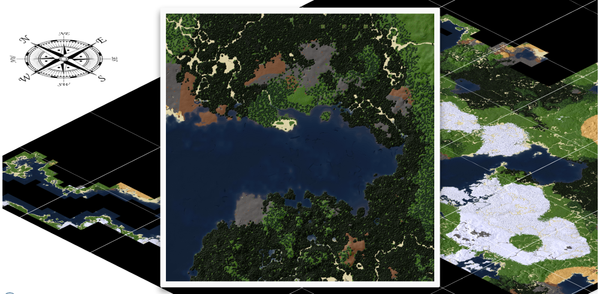

# Stonecraft WorldAtlas

A web-based viewer for Stonecraft/Luanti world maps generated with minetestmapper.



## Requirements

- C++ compiler, zlib, zstd
- libgd
- sqlite3
- LevelDB (optional)
- hiredis (optional)
- Postgres libraries (optional)
- ImageMagick


```
$ sudo apt-get install cmake git-core build-essential libgd-dev libsqlite3-dev libleveldb-dev libhiredis-dev libpq-dev zlib1g-dev libzstd-dev imagemagick
```

## Compilation on GNU/Linux (e.g. Ubuntu)

Download WorldAtlas via github:

```
$ cd <STONECRAFT-DIR>
$ git clone --depth 1 https://github.com/MrCerealGuy/Stonecraft-WorldAtlas.git worldatlas
```

Download minetestmapper via github:

```
$ cd worldatlas
$ git clone --depth 1 https://github.com/luanti-org/minetestmapper.git minetestmapper
```

Compile minetestmapper :

```
$ cd minetestmapper
$ cmake . -DENABLE_LEVELDB=1
$ make -j$(nproc)
```

## Usage

```
$ cd <STONECRAFT-DIR>/worldatlas
$ nano generate_map.sh
```

Edit *generate_map.sh* and set *WORLD_PATH* and *WWW_ROOT*, e.g.:

```
WORLD_PATH="/home/andreas/dev/stonecraft/worlds/MyWorld"
WWW_ROOT="/home/andreas/dev/stonecraft/worldatlas"
```

Run the script:

```
$ ./generate_map.sh
```

Now create a cronjob to do this stuff by your Stonecraft server.
